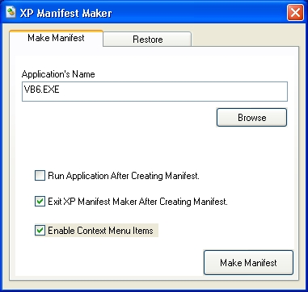



## Windows XP Visual Styles Manifest Maker For All Executables UPDATED\!

### Description

UPDATED!! Windows XP manifest maker for ALL EXECUTABLES. this means any program that wasnt created to use windows xp visual styles now can. UPDATED: added right click context menu, and ability to restore any changes you made, and also made it look xp and added tabs.
 
### More Info
 
vb6: when placing a button on a frame, it may not appear correctly.

             |
---                |---
**Submitted On**   |2001-10-09 23:45:06
**By**             |[Hectotized](https://github.com/Planet-Source-Code/PSCIndex/blob/master/ByAuthor/hectotized.md)
**Level**          |Beginner
**User Rating**    |4.3 (65 globes from 15 users)
**Compatibility**  |VB 6\.0
**Category**       |[VB function enhancement](https://github.com/Planet-Source-Code/PSCIndex/blob/master/ByCategory/vb-function-enhancement__1-25.md)
**World**          |[Visual Basic](https://github.com/Planet-Source-Code/PSCIndex/blob/master/ByWorld/visual-basic.md)
**Archive File**   |[Windows XP2830210102001\.zip](https://github.com/Planet-Source-Code/hectotized-windows-xp-visual-styles-manifest-maker-for-all-executables-updated__1-27928/archive/master.zip)

